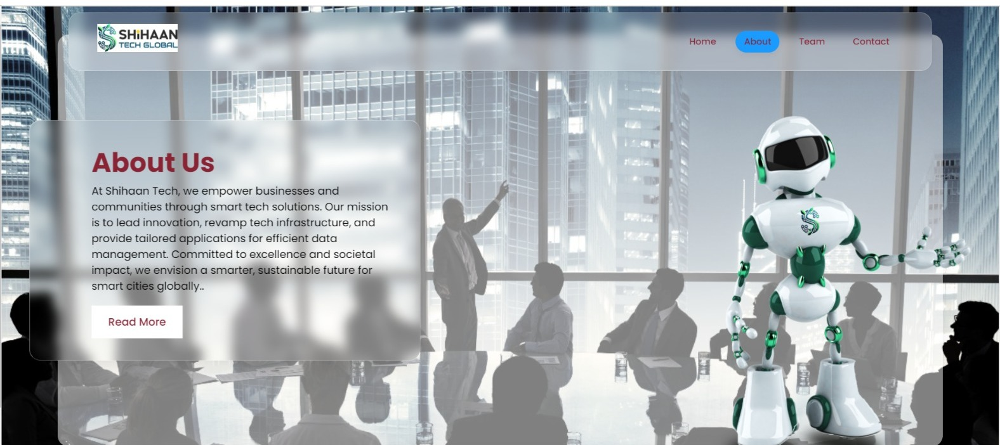

# Glassmorphism Web Page

A sleek webpage with glassmorphism design using HTML and CSS. Explore the modern UI!

## Files
- index.html: Main HTML file.
- styles.css: CSS file for styling.
- robo.png: Image file.
- BackgroundPhoto.png: Background image file.
- Shihaan-transparent-logo-144.png: Logo image file.

## Live Link
[Explore the Live Web Page](https://ishsmaji.github.io/SHIHAAN_TECH_GLOBAL/)

## Preview

## How to Use
1. Clone the repository.
2. Open index.html in your browser.
